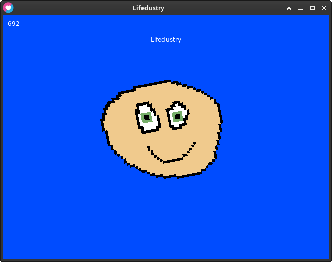

</img>

 
 
 

---------

Lifedustry est un RPG sandbox de type "bullet hell" en génération procédurale infinie. Il intègre différentes mécaniques comme des boss (similaires à ceux de Terraria, Undertale ou PixelQuest), des systèmes d'automatisation de ressources, de l'artisanat (crafting) et du butin (loot). C'est un jeu jouable en solo ou en LAN avec une vue 2D de dessus.

<a href="src/scene/test.lua"></img></a>

Screenshot from the test scene

# Contributing
If you want to contribute, you can read the [contributing guidelines](CONTRIBUTING.md).

# Requirement

GPU : OpenGL 2.1 ou OpenGL ES 2-capable graphics

Windows Vista x86 (32 Bits)

Windows XP requires installing [OneCoreAPI](https://github.com/shorthorn-project/One-Core-API-Binaries)

# Quickstart

### 1. Download LOve 2D 
## windows 
for windows users download in the oficial website here --> in [love2d.org](https://love2d.org).
## Linux
it should be in ur packet manager like arch:
 `sudo pacman -S love`

### 2. Download the repo or Clone the  repo  :

 `git clone https://github.com/TON_USER/Lifedustry.git`
 
### 5. open love2D with the main folder example with a terminal
## windows 
for windows users launch love2D with arg the main folder like shortcut, put the folder in the love.exe, and terminal
## Linux
and for linux users
`love ./`
